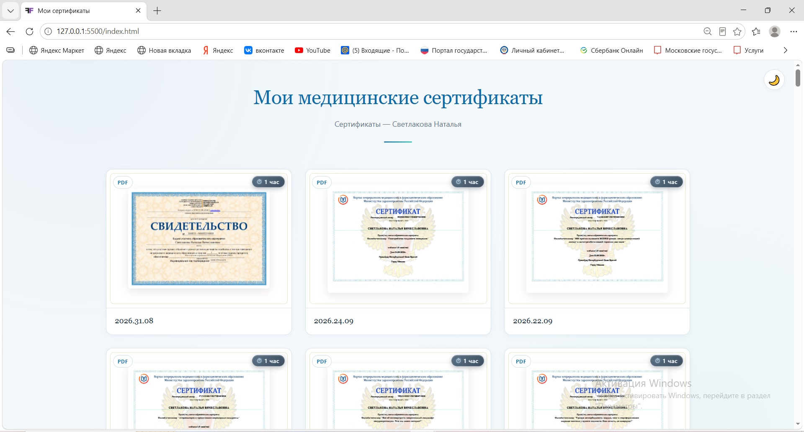
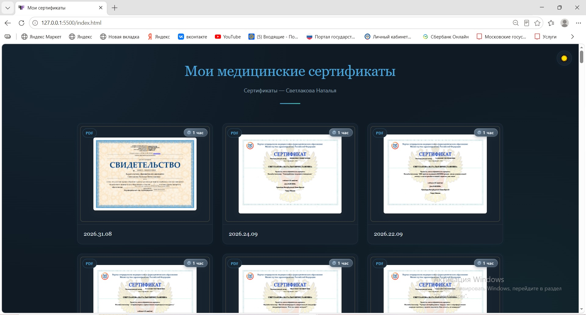

<div align="center">

# 🩺 Медицинские сертификаты

**Персональная онлайн-галерея сертификатов и удостоверений о повышении квалификации**

[](https://NatalyaSvetlakova.github.io/medical-certificates/)
[](https://developer.mozilla.org/ru/docs/Web/HTML)
[](https://developer.mozilla.org/ru/docs/Web/CSS)
[](https://developer.mozilla.org/ru/docs/Web/JavaScript)
[](#-лицензия)

[**🌐 Открыть галерею**](https://NatalyaSvetlakova.github.io/medical-certificates/) · [**🐛 Сообщить о проблеме**](https://github.com/NatalyaSvetlakova/medical-certificates/issues)

</div>

---

## 📸 Скриншот

<table>
  <tr>
    <td align="center">
      <br>
      <sub><b>Светлая тема</b></sub>
    </td>
    <td align="center">
      <br>
      <sub><b>Тёмная тема</b></sub>
    </td>
  </tr>
</table>

---

## 📖 О проекте

Персональная онлайн-галерея сертификатов и удостоверений о повышении квалификации. Файлы хранятся в репозитории, а страница автоматически подгружает их через GitHub API — **новые сертификаты появляются на сайте без правки кода**.

Страница выдержана в медицинской палитре: глубокий синий, бирюзовый акцент, сине-серые плашки. Поддерживает светлую и тёмную темы автоматически.

---

## ✨ Возможности

| | Возможность | Описание |
|---|---|---|
| 🔄 | **Автоподгрузка** | Файлы читаются из папки `certificates/` через GitHub API. Добавили файл → он сразу на сайте. |
| 🖼 | **Поддержка форматов** | JPG, JPEG, PNG, WebP, GIF, JFIF, BMP и PDF. |
| 📄 | **PDF-превью** | Первая страница PDF рендерится в миниатюру через PDF.js. |
| ⚡ | **Ленивая загрузка** | Превью PDF строятся только когда карточка попадает в поле зрения. |
| ⏱ | **Часы обучения** | Для каждого сертификата можно указать объём программы. |
| 🌗 | **Тёмная / светлая тема** | Автоматически по системным настройкам. |
| 📱 | **Адаптивность** | 3 колонки на десктопе, 2 на планшете, 1 на телефоне. |
| 🗓 | **Сортировка по дате** | Новые сертификаты — сверху. |
| 🇷🇺 | **Русские названия и метаданные** | Задаются через словари `TITLES`, `META`, `HOURS`. |

---

## 🗂 Структура проекта
medical-certificates/
├── index.html          (страница сертификатов)
├── articles.html       (новая страница статей)
├── articles.json       (данные статей)
├── sitemap.xml
└── certificates/       (папка с файлами сертификатов)


---

## 🚀 Быстрый старт

### Клонирование репозитория

```bash
git clone https://github.com/NatalyaSvetlakova/medical-certificates.git
cd medical-certificates